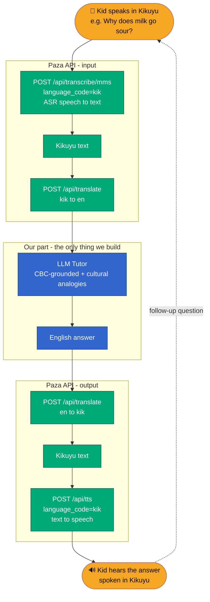

# Mwalimu Sauti — Hackathon Handoff & Context Doc

> **For humans and coding agents.** This is the authoritative context for building "Mwalimu Sauti", a hackathon prototype on top of the Paza API. It contains the idea, the verified API contract, the architecture, and an MVP build plan. Everything in the "Paza API" section was tested live on 2026-06-11 and works.

---

## 1. TL;DR

Build a **voice-first tutor** that lets a child in a rural/village setting learn school subjects (e.g. chemistry) by **speaking in their mother tongue and hearing answers back in the same language** — no reading, typing, or English required.

The Paza API gives us the full voice loop (speech-to-text, translation, text-to-speech) as hosted REST endpoints. **The only component we build is the LLM tutor** in the middle.

**Demo language: Kikuyu** (true vernacular, full loop confirmed). Swahili and Somali also work fully.

---

## 2. What is Paza (context)

Paza ("paza sauti" = "raise your voice" in Swahili) is **Microsoft Research Africa – Nairobi's** speech system for low-resource languages, born out of Project Gecko / Digital Green fieldwork with farmers. It covers six Kenyan languages: **Swahili, Dholuo (Luo), Kikuyu, Kalenjin, Maasai, Somali.**

For this hackathon we consume the **Paza inference API**, which bundles:
- **Paza speech models** — ASR (speech → text)
- **NLLB** (Meta) — machine translation
- **MMS-TTS / VITS** (Meta) — text-to-speech (lets us "speak back" in local languages)

---

## 3. The idea: Mwalimu Sauti ("Voice Teacher")

### Problem
Kids learn far better in their mother tongue in early years. Kenya's CBC mandates mother-tongue instruction in lower primary, but there are almost no STEM materials and few teachers who can teach science in Maasai/Kikuyu/Dholuo. Existing edtech silently assumes reading + typing + English — a wall for young or low-literacy learners.

### Solution
A spoken Q&A loop: the child talks, an LLM tutor (grounded in curriculum + culturally relevant analogies) answers, and the answer is spoken back in the child's language. ASR doubles as a **literacy-free assessment** mechanism — every spoken exchange is a record of what the child learned.

### What makes it unique (not "a chatbot in Kikuyu")
- **Voice-first, literacy-free** — the entire loop is spoken.
- **Culturally-grounded explanations** — teach via a child's world (milk, cattle, fire, soil), not lab beakers.
- **Vocabulary bridging** — teach the concept in the mother tongue, then introduce the English/Swahili science term ("...we call this *oxygen*").
- **Teacher/parent dashboard** — spoken exchanges become measurable learning data.
- **Offline-ready story** — Paza's small models can run on cheap devices with low connectivity (production path).

---

## 4. Architecture / Flow



**Green = Paza API (hosted, free to us). Blue = our LLM tutor. Orange = the child.**

---

## 5. Paza API reference (verified live 2026-06-11)

**Base URL:** `https://paza-server-guheh7eyfsb0adhr.westeurope-01.azurewebsites.net`
**Swagger UI:** `https://paza-ui-f6d5edffdagghgf0.westeurope-01.azurewebsites.net/api-docs`
**OpenAPI spec:** `GET {base}/openapi.json`

### Auth
All routes require an **Azure AD bearer token** for scope `api://f85d942a-d1eb-471b-b227-1f24ae629dc3/Paza.Use`.

```bash
az account get-access-token \
  --scope "api://f85d942a-d1eb-471b-b227-1f24ae629dc3/.default" \
  --query accessToken -o tsv
```
Then send `Authorization: Bearer <token>`.
- Recovery: if you see `AADSTS50076` or "no subscriptions found", run `az login` first.
- Alternative behind Azure Easy Auth: `x-ms-client-principal-id` / `x-ms-client-principal-name` headers.
- **Consent gate:** routes that read/write user content require a consent record via `POST /api/users/consent`, else `403 Forbidden`. (The signed-in user already accepted consent through the UI.)

### Core inference endpoints

| Method | Path | Purpose | Body |
|---|---|---|---|
| GET  | `/api/models` | List models + supported languages | — |
| POST | `/api/transcribe/{model_id}` | ASR: audio → text | `multipart/form-data`: `file` (.webm, binary, required), `language_code` (optional) |
| POST | `/api/translate` | Text translation (NLLB) | JSON: `{text, src_lang, tgt_lang?}` |
| POST | `/api/tts` | Text → speech (MMS-TTS) | JSON: `{text, language_code?, format?}` |
| GET  | `/api/tts/languages` | TTS languages currently loaded | — |
| GET  | `/api/guide` | Auth/usage guide | — |

`model_id` ∈ `phi` (paza-Phi-4-multimodal-instruct), `mms` (paza-mms-1b-all, **recommended for low-resource**), `whisper` (paza-whisper-large-v3-turbo — currently `not-configured`/unavailable).

`/api/translate` body: `src_lang` (required), `tgt_lang` (defaults to `en` if omitted).
`/api/tts` body: `format` = `json` (default, returns base64 WAV) or `wav` (binary stream). JSON response shape:
```json
{ "audio_base64": "...", "sample_rate": 16000, "content_type": "audio/wav", "language_code": "kik" }
```

### Data / telemetry endpoints (optional, for the teacher-dashboard stretch)
`POST /api/users`, `POST|GET /api/users/consent`, `POST /api/users/lookup`,
`POST|PUT /api/recordings`, `POST /api/recordings/audio`, `GET /api/recordings/{id}`, `GET /api/recordings/completed-transcripts?language=`,
`POST /api/eval-metrics` (WER/CER), `POST /api/feedback` (1–5 rating), `POST /api/tts/review`, `POST /api/translate/review`, `GET /api/storage/info`.

### ⚠️ Language support differs per model — plan around this

| Capability | Supported language codes |
|---|---|
| **Transcribe (ASR)** | `en` (Phi only), `swh`, `kik`, `som`, `kln`, `mas`, `luo` |
| **Translate (NLLB)** | `en`, `swh`, `kik`, `som`, `luo` |
| **TTS (MMS)** | `en`, `swh`, `kik`, `som`, `kln`, `mas` |

**Full voice-in → voice-out loop (ASR + translate both ways + TTS) works cleanly only for: `swh`, `kik`, `som`.**
- `mas` (Maasai), `kln` (Kalenjin): ASR + TTS work, but **no NLLB translation** → can't bridge to English text via the API.
- `luo` (Dholuo): ASR + translation work, but **no TTS** → can't speak back.

**→ Build the demo in Kikuyu (`kik`).** Present Maasai as the aspirational example.

### Language codes
`en` English · `swh` Swahili · `kik` Kikuyu · `som` Somali · `kln` Kalenjin · `mas` Maasai · `luo` Dholuo

---

## 6. Quick-start: prove the loop in 60 seconds (PowerShell, tested)

```powershell
$tok  = az account get-access-token --scope "api://f85d942a-d1eb-471b-b227-1f24ae629dc3/.default" --query accessToken -o tsv
$base = "https://paza-server-guheh7eyfsb0adhr.westeurope-01.azurewebsites.net"
$h    = @{ Authorization = "Bearer $tok"; "Content-Type" = "application/json" }

# Translate English -> Kikuyu
Invoke-RestMethod "$base/api/translate" -Method Post -Headers $h `
  -Body (@{ text="Why does milk go sour?"; src_lang="en"; tgt_lang="kik" } | ConvertTo-Json)
# => { translation = "Kĩrĩa gĩtũmaga iria rĩtuĩke rĩũmũ nĩ kĩĩ?" }

# Speak Kikuyu text (returns base64 WAV)
Invoke-RestMethod "$base/api/tts" -Method Post -Headers $h `
  -Body (@{ text="Niki iria rionjoragio?"; language_code="kik"; format="json" } | ConvertTo-Json)
```

Verified outputs:
- `en→swh` "Why does milk go sour?" ⇒ **"Kwa nini maziwa huwa machungu?"**
- `en→kik` "Why does milk go sour?" ⇒ **"Kĩrĩa gĩtũmaga iria rĩtuĩke rĩũmũ nĩ kĩĩ?"**
- `tts kik` and `tts mas` both return real audio (`audio_base64`).

> **To confirm:** the exact JSON field name returned by `/api/transcribe/{model_id}` (likely a `transcription`/`transcript` field). Test once with a real `.webm` clip — browsers' `MediaRecorder` produces `audio/webm;codecs=opus` by default, which matches the expected `.webm` upload.

---

## 7. Suggested tech stack & responsibilities

- **Frontend (web):** mic capture via the browser `MediaRecorder` API → `.webm` blob; play returned audio by decoding base64 WAV into an `<audio>` element. Plain HTML/JS or React/Next — keep it simple for the demo.
- **Backend (thin proxy):** Node/Express or Python/FastAPI. Holds the Azure AD token server-side (never expose it to the browser), orchestrates the chain: transcribe → translate → LLM → translate → tts. Returns text + audio to the UI.
- **LLM tutor (the part we own):** Azure OpenAI / GPT. CBC-grounded system prompt + a tiny RAG over ~5 curriculum facts per topic. Keep answers short (1–3 sentences) so translation + TTS stay clean.
- **Optional:** log sessions to the `/api/recordings` + `/api/feedback` endpoints to power a teacher dashboard.

### Starter LLM tutor system prompt
```
You are Mwalimu Sauti, a warm primary-school teacher for a young child in rural Kenya.
You are answering a child's spoken question. Rules:
- Answer in simple English (it will be translated to the child's language).
- Keep it to 1–3 short sentences. Use a concrete local analogy (cattle, milk, fire,
  soil, market) a Kenyan child would know.
- Teach the concept first, then name the science term once: "...we call this <term>".
- End with one short follow-up question to check understanding.
- Never invent facts; stay within the lesson topic provided in context.
Lesson topic: {topic}
Curriculum facts you may use: {rag_snippets}
```

---

## 8. MVP scope (so we finish)

1 language (**Kikuyu**), 1 subject, ~3 topics.
- [ ] Mic capture → `.webm` in the browser
- [ ] Backend proxy with token handling + the 4-call chain
- [ ] LLM tutor with the prompt above + 3–5 hardcoded curriculum facts
- [ ] Audio playback of the Kikuyu answer
- [ ] Minimal UI: big mic button, waveform/recording state, conversation thread
- [ ] (Stretch) Teacher dashboard from recorded transcripts

### Demo moment
A teammate plays the child: speaks *"Why does milk go sour?"* in Kikuyu → tutor explains fermentation with a milk/cattle analogy, spoken back in Kikuyu → asks a follow-up → "child" answers → tutor confirms. Then show the session transcript.

---

## 9. Risks & mitigations

| Risk | Mitigation |
|---|---|
| Translation quality for low-resource langs is rough | Keep tutor answers short & literal; pre-test the demo topics; pick `kik` (full stack). |
| LLM hallucination (kids' content) | Ground with curriculum RAG, tight topic scope, short answers, guardrail prompt. |
| `whisper` model unavailable | Use `mms` (recommended for low-resource) or `phi` for transcription. |
| Latency of a 4-call chain | Cache, stream UI states ("listening → thinking → speaking"), keep text short. |
| Maasai can't translate via API | Demo in Kikuyu; frame Maasai/Dholuo gaps as "where the pipeline goes next". |

---

## 10. Open decisions for the team
- Final language (recommend **Kikuyu**) and subject/topics.
- Build target: web (fastest demo) vs Android (closer to the rural reality).
- Which transcription model: `mms` (low-resource recommended) vs `phi` (multimodal).
- How far to take the teacher dashboard.

---

*Source: Paza API explored and tested live 2026-06-11. Public refs: MSR Paza blog, HuggingFace `microsoft/paza` collection, PazaBench leaderboard.*
